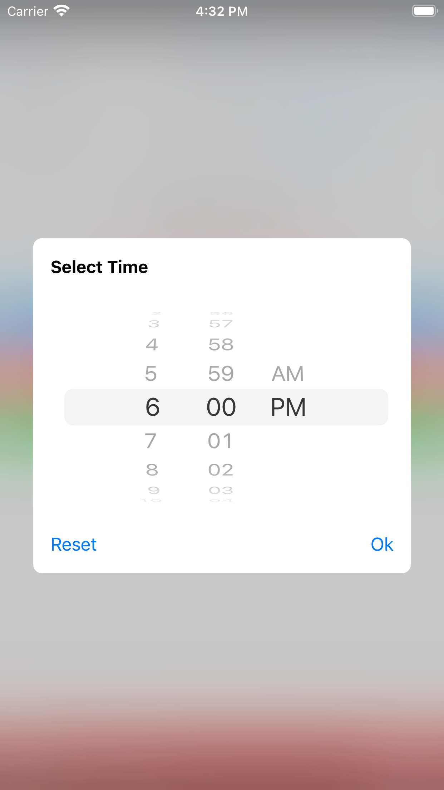

# wm-cordova-plugin-common

A Cordova plugin that provides common requirements and API to all WaveMaker mobile applications.

## Android

1. By default, server url domain is set as hostname to use. This can be overridden with the following.

- By setting hostname preference in config.xml under platform Android.

- Set value to useNativeXHR as true in config.json.

2. Cookies between web view and Cookie Manager are synced automatically, but with some delay. To manual trigger cookie synchronization, following method is added.

```cordova.wavemaker.syncCookies();```

## iOS

### Date Picker
#### cordova.wavemaker.datePicker.selectDate(options, successCallback, errorCallback)
shows calendar UI to the user for date and time selection. Following are the arguments.

**NOTE:** If mode is selected as TIME, minDate and maxDate should be same but with different times.

**options**
| name | description |
--|--
| selectedDate | time in millis from 1970 |
| minDate | time in millis from 1970 |
| maxDate | time in millis from 1970 |
| mode | allowed values are DATE, TIME or DATE_TIME. Default value is DATE_TIME|
| title | to set title of dialog. If not given, appropriate title will be shown based on mode.|

**successCallback(result)**
This will be called after the user taps on either ok or reset button.
- **result** has two properties.

| name | description |
--|--
| type | OK or RESET |
| date | represents the user selected value, if user taps on ok button. If user taps on RESET button, empty will be returned.|
	
##### errorCallback(error)
This will be called if any exception happens.

| Date | Date and Time | Time |
--|--|--
|  |  |  |
  

## License

Apache License - 2.0